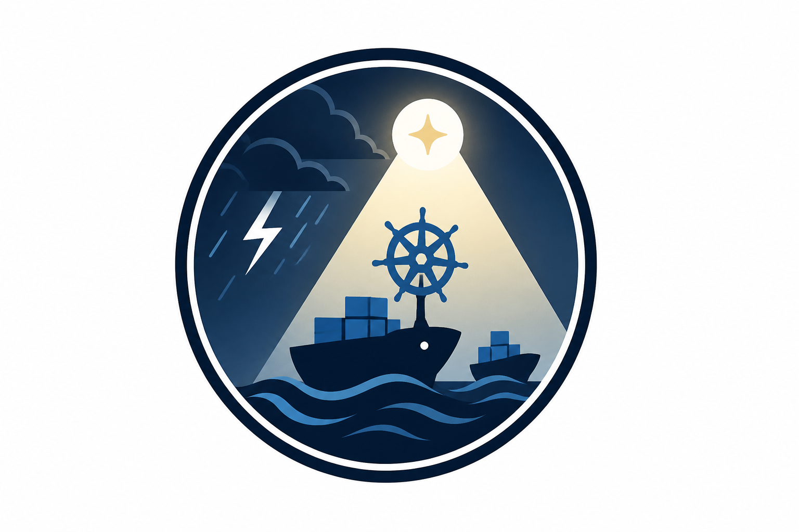

<p align="center">
  
</p>

# ClusterSage

<p align="center">AI-powered Kubernetes diagnosis and resilience testing for local clusters.</p>

<p align="center"><strong>From cluster storms to clear, explainable diagnosis.</strong></p>

## Demo Video

<div style="margin: 24px 0 32px 0;">
<a href="https://youtu.be/epca93qov_0" target="_blank">
  
</a>
</div>

Click the preview above to watch the demo.

## Overview

ClusterSage helps you:

- Bootstrap a local Kubernetes demo namespace
- Inject controlled failures (CrashLoop, Pending, Service misconfiguration)
- Diagnose cluster health with LLM-assisted analysis
- Observe pod status, synthetic metrics, and logs from one UI

This repository is currently optimized for a **Streamlit-first workflow**.

## Brand Direction

ClusterSage uses a navigation-inspired identity with specific technical meaning:

- Ships represent Docker workloads moving through the system
- The ship wheel represents Kubernetes orchestration and control
- The beam of light represents AI guidance that helps operators navigate incidents
- The storm represents cluster failures, instability, and unknown root causes

The app behavior and flows remain unchanged; this branding alignment is documentation-only.

## Current Feature Set

- Real-time pod dashboard with refresh loop
- AI diagnosis panel with streaming output
- Chaos controls for common failure scenarios
- Pod lifecycle controls (create/delete/pause/start)
- Namespace-scoped operations (`ai-ops` by default)
- Trace and evidence utility modules for backend diagnostics

## Tech Stack

- Python 3.10+
- Streamlit
- Kubernetes (`kubectl`, `kustomize` manifests)
- Ollama (local model serving)
- LangChain (installed dependency set)

## Repository Structure

```text
.
|-- README.md
|-- banner.png
|-- requirements.txt
|-- start-diagnosis.ps1
|-- backend/
|   |-- app.py
|   |-- cli.py
|   |-- agent/
|   \-- tools/
|-- k8s/
|   \-- manifests/
\-- ui/
    \-- streamlit_app.py
```

## Prerequisites

- Docker Desktop running
- `kubectl` installed and accessible
- Python 3.10+
- Ollama running locally

Optional but recommended:

- `kind` for local cluster creation/management

## Quick Start (Recommended)

1. Install dependencies:

```powershell
python -m venv .venv
.\.venv\Scripts\Activate.ps1
pip install -r requirements.txt
```

2. Start Ollama and pull a model:

```powershell
ollama serve
ollama pull qwen:7b
```

3. Launch the app:

```powershell
.\start-diagnosis.ps1 web
```

Or run directly:

```powershell
streamlit run ui/streamlit_app.py
```

4. Open `http://localhost:8501` and click **Initialize Cluster**.

## Streamlit UI Workflow

### 1. Initialize

- Use sidebar `Initialize Cluster` to apply manifests in namespace `ai-ops`.

### 2. Trigger or Revert Faults

Chaos controls in sidebar:

- `CrashLoop Orders`
- `Pending Payments`
- `Break Gateway Service`
- `Revert All`

### 3. Diagnose

- Enter a natural-language question in the diagnosis panel
- Click `Analyze`
- Review diagnosis, pod state, and collected logs

### 4. Inspect/Operate Pods

Pod operations available from sidebar:

- Pause/start deployments
- Create/delete test pods

## Kubernetes Manifests

The demo app is defined in [k8s/manifests/microservices.yaml](k8s/manifests/microservices.yaml) with services:

- `gateway`
- `orders`
- `payments`

Namespace manifest: [k8s/manifests/namespace.yaml](k8s/manifests/namespace.yaml)

## Backend Utilities

The backend contains modules for:

- Cluster operations: [backend/tools/k8s_manager.py](backend/tools/k8s_manager.py)
- Evidence snapshots: [backend/tools/evidence_collector.py](backend/tools/evidence_collector.py)
- Traffic emulator: [backend/tools/traffic_emulator.py](backend/tools/traffic_emulator.py)
- Trace persistence: [backend/tools/trace_logger.py](backend/tools/trace_logger.py)
- AI agent logic: [backend/agent/ai_agent.py](backend/agent/ai_agent.py)

## Notes

- This project targets local/sandbox Kubernetes environments.
- Fault injection features are intended for safe testing only.
- No production cluster targeting is intended by default.
- App logic and UI behavior were intentionally not modified to preserve recorded demo parity.

## Team

- Harsha C - Project Lead, AI and Backend
  - GitHub: https://github.com/Mr-hars007

## License

This project is licensed under the ClusterSage Personal Use License (CPUL) v1.0.

Commercial usage requires a separate commercial license. For inquiries, contact the author via GitHub: https://github.com/Mr-hars007

See [LICENSE](LICENSE) for full terms.
